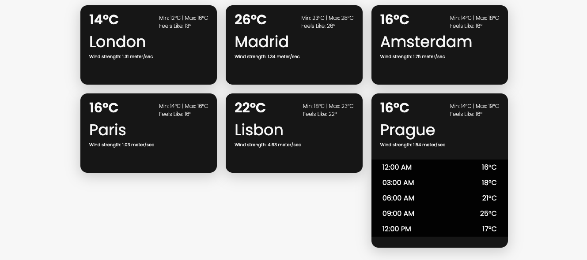
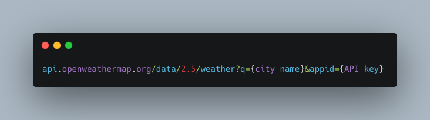
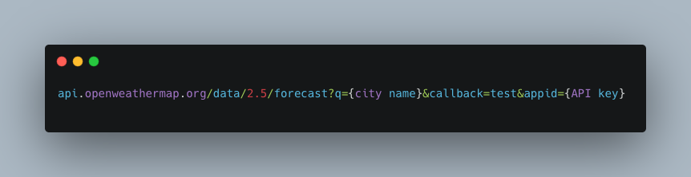

<h1 align="center">Welcome to weather-app 👋</h1>
<p>
  <a href="https://www.npmjs.com/package/weather-app" target="_blank">
    
  </a>
</p>

<h3 align="center">
Used Open Weather Data to create a single page app that features a list of 5 European cities and their current weather situation, and clicking on an item shows the forecast for the next hours.
</h3>



<h4 align="center"><a href="http://openweathermap.org/current" blank>Open Weather Data API</a></h4>
<h6>Below you can find the urls used to get the data used in the application. If you want to test only as URLs, you can use the postman or insomnia and inform the requested data (city and API key)</h6>

## Call current weather data for one location


## Call 5 day / 3 hour forecast data


## Clone de project

```sh
git clone https://github.com/maisamaximo/weather-app.git
```

## Enter at the folder

```sh
cd weather-app
```

## Install

```sh
npm install
```

## Usage

```sh
ng serve
```

## Run on port

```sh
http://localhost:4200/
```
